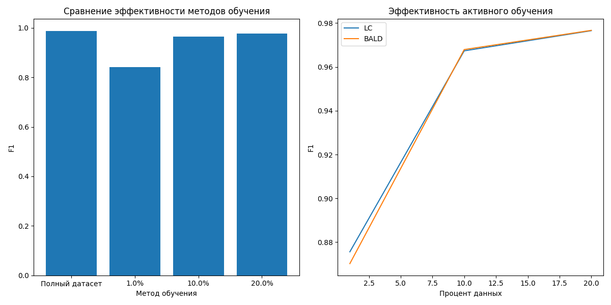

# Курсовая работа.

Выполнил студент группы М8О-209М-23: Союзов Владимир Александрович

## Задача:

Эксперимент по активному обучению на наборе данных MNIST с использованием модели LeNet-5. 
Необходимо было сравнить эффективность двух алгоритмов активного обучения — Least Confidence 
(LC) и Bayesian Active Learning by Disagreement (BALD) — при выборке 1%, 10% и 20% данных.

## Используемые инструменты и методы:

Датасет: MNIST
Модель: LeNet-5
Алгоритмы активного обучения: Least Confidence (LC) и Bayesian Active Learning by Disagreement (BALD)
Библиотеки: TensorFlow и NumPy для реализации модели и алгоритмов, а также Scikit-learn для некоторых вспомогательных функций.

## Сравнение результатов:

1% данных:
    LC: 0.8756
    BALD: 0.8702

На этом уровне размера выборки LC показывает немного лучшие результаты, чем BALD. Это может быть связано с тем, что LC более агрессивно выбирает данные с наименьшей уверенностью, что в данном случае приводит к более эффективному обучению.

10% данных:

    LC: 0.9673
    BALD: 0.9679

При увеличении размера выборки до 10% оба алгоритма демонстрируют очень высокие значения F1. BALD слегка превосходит LC, что может указывать на то, что учет неопределенности модели в BALD становится более важным при большем количестве данных.

20% данных:

    LC: 0.9766
    BALD: 0.9767

На этом уровне размера выборки оба алгоритма достигают практически одинаковых результатов, с небольшим преимуществом у BALD. Это говорит о том, что при достаточном количестве данных оба метода могут обеспечить очень высокое качество обучения.

## Метрика:

